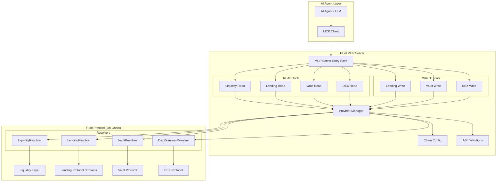
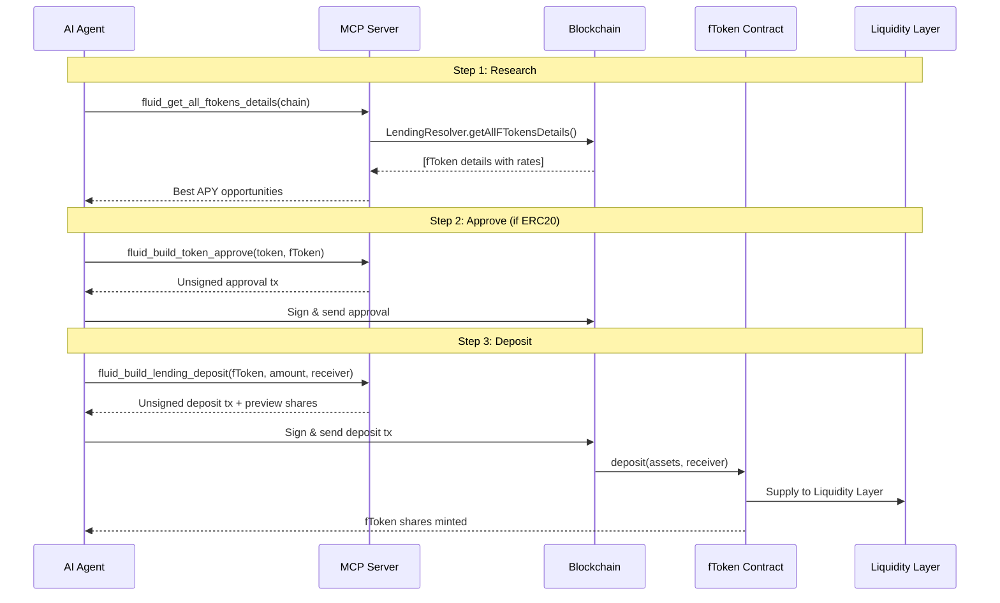
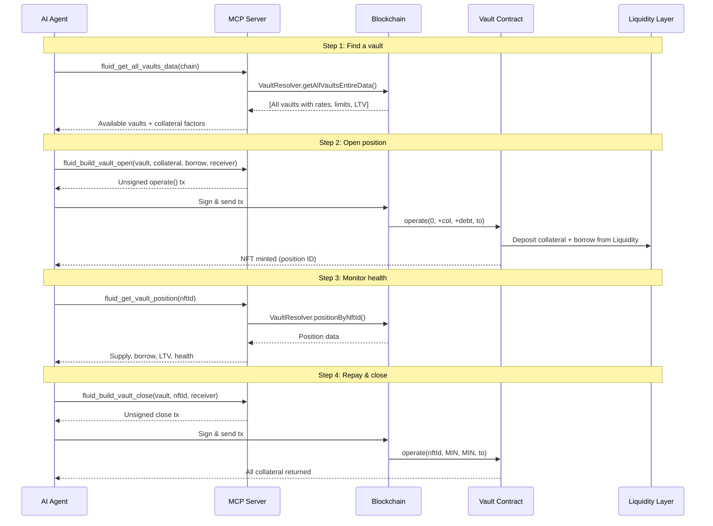
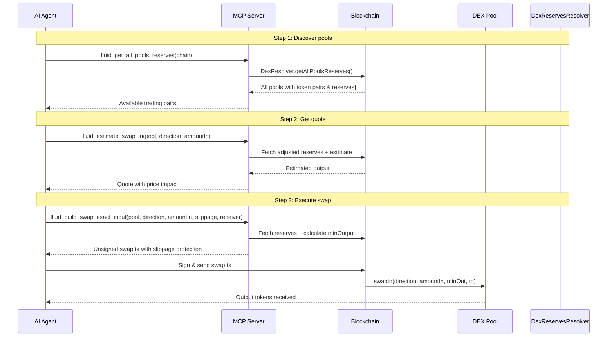

# Fluid MCP Server

A production-ready [Model Context Protocol (MCP)](https://modelcontextprotocol.io) server that enables AI agents to interact with the **Fluid DeFi Protocol** across all supported chains.

Fluid is a next-generation DeFi protocol by [Instadapp](https://instadapp.io) that unifies **lending**, **borrowing**, and **DEX trading** into a single capital-efficient liquidity layer.

## Supported Chains

| Chain | Chain ID | Protocols |
|-------|----------|-----------|
| Ethereum | 1 | Liquidity, Lending, Vault, DEX |
| Arbitrum | 42161 | Liquidity, Lending, Vault, DEX |
| Base | 8453 | Liquidity, Lending, Vault, DEX |
| Polygon | 137 | Liquidity, Lending, Vault, DEX |

## Quick Start

### Install & Run

```bash
# Install globally
npm install -g @fluid-mcp/server

# Or run directly with npx
npx @fluid-mcp/server
```

### Add to Claude Desktop

Add to your Claude Desktop config (`~/.claude/claude_desktop_config.json`):

```json
{
  "mcpServers": {
    "fluid": {
      "command": "npx",
      "args": ["@fluid-mcp/server"]
    }
  }
}
```

### Add to Claude Code

```bash
claude mcp add fluid -- npx @fluid-mcp/server
```

### Build from Source

```bash
git clone https://github.com/ahmadmardeni/fluid-mcp-server.git
cd fluid-mcp-server
npm install
npm run build
npm start
```

## Architecture



## Tool Reference

### READ Tools (No wallet required)

These tools query on-chain data through Fluid's resolver contracts. They are completely read-only and require no wallet or private key.

#### Liquidity Layer

| Tool | Description |
|------|-------------|
| `fluid_get_listed_tokens` | List all tokens in the Liquidity Layer |
| `fluid_get_token_rates` | Get supply/borrow rates for a specific token |
| `fluid_get_all_tokens_data` | Dashboard view of all tokens with rates and TVL |
| `fluid_get_user_supply` | Query a user's supply position for a token |
| `fluid_get_user_borrow` | Query a user's borrow position for a token |
| `fluid_get_revenue` | Get protocol revenue for a token |

#### Lending Protocol (fTokens)

| Tool | Description |
|------|-------------|
| `fluid_get_all_ftokens` | List all fToken addresses |
| `fluid_get_ftoken_details` | Get details for a specific fToken (rates, TVL, asset) |
| `fluid_get_all_ftokens_details` | Dashboard view of all fTokens |
| `fluid_get_user_lending_position` | Get user's position in an fToken pool |
| `fluid_get_ftoken_rewards` | Get reward program info for an fToken |

#### Vault Protocol

| Tool | Description |
|------|-------------|
| `fluid_get_all_vaults` | List all vault addresses |
| `fluid_get_vault_data` | Get comprehensive vault data (rates, limits, totals) |
| `fluid_get_all_vaults_data` | Dashboard view of all vaults |
| `fluid_get_vault_position` | Get a position by NFT ID |
| `fluid_get_user_vault_positions` | Get all positions owned by a user |
| `fluid_get_liquidations` | Get available liquidation opportunities |

#### DEX Protocol

| Tool | Description |
|------|-------------|
| `fluid_get_dex_pools` | List all DEX pool addresses |
| `fluid_get_pool_reserves` | Get reserves for a specific pool |
| `fluid_get_all_pools_reserves` | Get reserves for all pools |
| `fluid_get_pool_adjusted_reserves` | Get adjusted reserves (for swap math) |
| `fluid_estimate_swap_in` | Estimate output for a given input |
| `fluid_estimate_swap_out` | Estimate required input for a desired output |

### WRITE Tools (Wallet required)

These tools build **unsigned transaction data**. The calling agent must sign and broadcast the transaction using the user's wallet.

#### Lending Operations

| Tool | Description |
|------|-------------|
| `fluid_build_lending_deposit` | Build deposit tx (ERC20 → fToken) |
| `fluid_build_lending_deposit_native` | Build native ETH deposit tx |
| `fluid_build_lending_withdraw` | Build withdrawal tx (fToken → asset) |
| `fluid_build_lending_redeem` | Build redeem tx (burn shares for assets) |
| `fluid_build_token_approve` | Build ERC20 approval tx |

#### Vault Operations

| Tool | Description |
|------|-------------|
| `fluid_build_vault_open` | Open new vault position (deposit + optional borrow) |
| `fluid_build_vault_operate` | Modify existing position (add/remove collateral, borrow/repay) |
| `fluid_build_vault_close` | Close position (repay all + withdraw all) |

#### DEX Operations

| Tool | Description |
|------|-------------|
| `fluid_build_swap_exact_input` | Build swap tx with exact input amount |
| `fluid_build_swap_exact_output` | Build swap tx for exact output amount |

## Protocol Flow Diagrams

### Lending Flow (Deposit & Earn)



### Vault Flow (Borrow Against Collateral)



### DEX Swap Flow



## Transaction Signing

This MCP server follows a **non-custodial** design. Write tools return **unsigned transaction data** — the JSON response contains:

```json
{
  "chain": "ethereum",
  "action": "deposit",
  "to": "0x...",       // Contract to call
  "data": "0x...",     // Encoded calldata
  "value": "0",        // ETH value to send (wei)
  "description": "...",
  "note": "..."
}
```

The calling agent is responsible for:

1. Connecting to the user's wallet (e.g., via ethers.js, web3.js, or wallet SDK)
2. Signing the transaction with the user's private key
3. Broadcasting the signed transaction to the blockchain
4. Monitoring the transaction for confirmation

**Example (ethers.js v6):**

```typescript
import { ethers } from "ethers";

// After receiving tx data from MCP tool:
const wallet = new ethers.Wallet(PRIVATE_KEY, provider);
const tx = await wallet.sendTransaction({
  to: toolResult.to,
  data: toolResult.data,
  value: BigInt(toolResult.value),
});
const receipt = await tx.wait();
```

## Custom RPC URLs

Every tool accepts an optional `rpc_url` parameter to use a custom RPC endpoint instead of the default public one. This is recommended for production use to avoid rate limits.

```json
{
  "chain": "ethereum",
  "rpc_url": "https://eth-mainnet.g.alchemy.com/v2/YOUR_KEY"
}
```

## Environment Variables

| Variable | Description | Default |
|----------|-------------|---------|
| `FLUID_RPC_ETHEREUM` | Custom RPC for Ethereum | Public RPC |
| `FLUID_RPC_ARBITRUM` | Custom RPC for Arbitrum | Public RPC |
| `FLUID_RPC_BASE` | Custom RPC for Base | Public RPC |
| `FLUID_RPC_POLYGON` | Custom RPC for Polygon | Public RPC |

## Resources

The server exposes two MCP resources:

- `fluid://chains` — Supported chains and available protocols per chain
- `fluid://overview` — Protocol architecture overview with links

## Prompts

Three built-in prompts guide agents through common workflows:

- `analyze-lending-rates` — Find the best lending yield opportunities
- `check-vault-health` — Assess a vault position's health and risk
- `find-swap-route` — Find optimal swap routes on Fluid DEX

## Project Structure

```
fluid-mcp-server/
├── src/
│   ├── index.ts                 # MCP server entry point
│   ├── config/
│   │   └── chains.ts            # Multi-chain contract addresses
│   ├── abis/
│   │   └── index.ts             # Minimal ABI definitions
│   ├── tools/
│   │   ├── index.ts             # Tool registry
│   │   ├── liquidity-read.ts    # Liquidity Layer queries
│   │   ├── lending-read.ts      # fToken lending queries
│   │   ├── vault-read.ts        # Vault protocol queries
│   │   ├── dex-read.ts          # DEX pool queries + swap estimates
│   │   ├── lending-write.ts     # Lending transaction builders
│   │   ├── vault-write.ts       # Vault transaction builders
│   │   └── dex-write.ts         # DEX swap transaction builders
│   └── utils/
│       ├── provider.ts          # Ethers.js provider management
│       └── formatting.ts        # Data formatting utilities
├── package.json
├── tsconfig.json
├── README.md
└── LICENSE
```

## Contract Address Updates

Fluid's resolver contracts are periodically redeployed as the protocol evolves. The addresses in `src/config/chains.ts` are accurate as of the build date.

To get the latest addresses, check:
- [Fluid deployments.md](https://github.com/Instadapp/fluid-contracts-public/blob/main/deployments/deployments.md)
- [Fluid Technical Docs](https://docs.fluid.instadapp.io/contracts/contract-addresses.html)

## References

- [Fluid Protocol](https://fluid.io)
- [Fluid Technical Docs](https://docs.fluid.instadapp.io)
- [Fluid Contracts (GitHub)](https://github.com/Instadapp/fluid-contracts-public)
- [Fluid Governance](https://gov.fluid.io)
- [MCP Specification](https://modelcontextprotocol.io)
- [MCP TypeScript SDK](https://github.com/modelcontextprotocol/typescript-sdk)

## License

MIT
